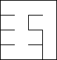

# mfp-python3-examples
Examples in [Mazes for Programmers](http://www.mazesforprogrammers.com/) in Python3

## ./chapter02/sidewinder.png 

## ./chapter03/colorized.png

## ./chapter04/aldous_broder.png

## ./chapter04/aldous_broder_00.png

## ./chapter04/aldous_broder_01.png

## ./chapter04/aldous_broder_02.png

## ./chapter04/aldous_broder_03.png

## ./chapter04/aldous_broder_04.png

## ./chapter04/aldous_broder_05.png

## ./chapter04/wilsons.png

## ./chapter05/hunt_and_kill.png

## ./chapter05/recursive_backtracker.png

## ./chapter06/mask_circle.png

## ./chapter06/mask_hi_there.png

## ./chapter06/mask_stick_man.png

## ./chapter06/masked.png

## ./chapter06/mfp-mask.png

## ./chapter07/cirle_maze.png

## ./chapter07/polar.png

## ./chapter08/delta.png

## ./chapter08/hex.png

## ./chapter09/inset.png

## ./chapter09/weave.png

## ./chapter10/kruskals.png

## ./chapter10/weave_kruskals.png

## ./chapter11/growing-tree-last.png

## ./chapter11/growing-tree-mix.png

## ./chapter11/growing-tree-random.png

## ./chapter11/prims-simple.png

## ./chapter12/ellers.png

## ./chapter12/recursive_division.png

